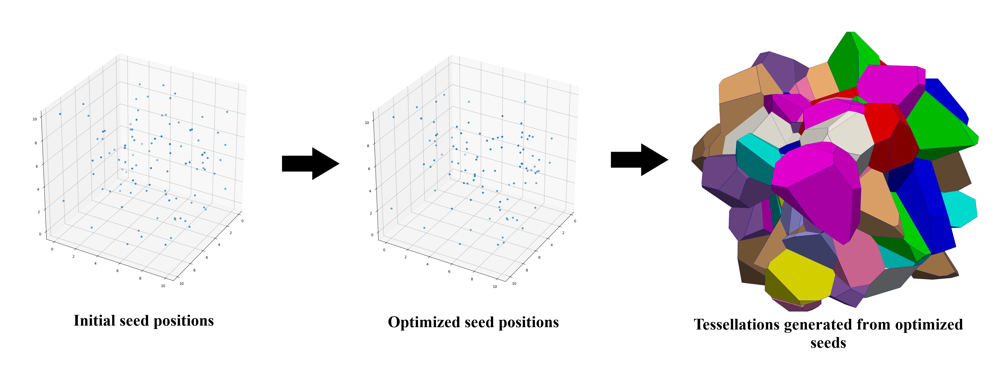

<div style="text-align: justify">

# **OptiMic**
### **A tool to generate optimized polycrystalline microstructures for materials simulations**

| |
| :---: |
| **Overview of generating tessellations** |

|  |
| :---: |
| |
| **Overview of meshing process** |

OptiMic is an open-source software to generate optimized microstructures in 2D or 3D, for finite element and atomistic simulations. It comprises of a feature to provide extensive control to the user on optimization through custom user defined cost functions. 

This was created as part of "Personal Programming Project (PPP)" coursework in "Computation Materials Science (CMS)" M. Sc program at TU Bergakademie Freiberg, Germany.

# **Quick Start**

The tool can be directly cloned from the [**git repository**](https://gitlab.com/arun.prakash.mimm/optimic.git) to your desired directory. In order to install this package, navigate in the terminal to the directory `optimic`.

Before starting, please ensure that you have statisfied all the [**requirements**](https://gitlab.com/arun.prakash.mimm/optimic/-/wikis/Home/Requirements#requirements) and most importantly, ensure that you have installed all the [**required libraries**](https://gitlab.com/arun.prakash.mimm/optimic/-/wikis/Home/Requirements/installing_libraries#installing-libraries).

## **Basic Usage**

For detailed reference usage manual please [**click here**](https://gitlab.com/arun.prakash.mimm/optimic/-/wikis/Home/usage_manual/list_of_options/list_of_options#list-of-options).

### **Navigate to the directory and changing file permissions**

First ensure that you are in the correct directory. `pwd` command can be used to find the current working directory.

```bash
$ pwd
/..some_directories../optimic
```
Once you are in the correct directory, the package can be installed by using:

```bash
$ pip install .
```
***Note:** Please notice that there is a dot (.) in the command above.*

In order to execute the program, you can now use:

```bash
$ optimic input-arguments
```
where input-arguments denote options.

### **Undertanding available options**

It is better to have a grasp of the options available

```bash
$ optimic main --help
```
The following would be displayed:
```bash
==================================
  ___        _   _ __  __ _   
 / _ \ _ __ | |_(_)  \/  (_) ___  
| | | | '_ \| __| | |\/| | |/ __| 
| |_| | |_) | |_| | |  | | | (__  
 \___/| .__/ \__|_|_|  |_|_|\___| 
      |_|                        
==================================
Optimized Microstructure Generator
Copyright © 2020-2021
Authors: P. H. Serrao, S. Sandfeld, A. Prakash
Version: v2.0

Usage: optimic main [OPTIONS]

Options:
  -s, --size FLOAT...             Size of simulation box along X, Y & Z
                                  direction in the format n n n  [required]
  -dim, --dimension INTEGER       Dimension of study ie; 2D or 3D in the
                                  format n where n is an integer
  -n, --number_seed INTEGER       Number of seeds/grains in the format n
  -t, --target TEXT               Target distribution file name as a string
                                  stored in the same directory where the
                                  package is executed from
  -c, --characteristic INTEGER    The characteristic that has to be optimized
                                  in the format n where n corresponds to the
                                  integer number corresponding to the
                                  characteristic
  -m, --material TEXT             The name of the material as a string
  -sdir, --stress_direction INTEGER...
                                  The direction of stress for computing the
                                  Schmid Factors
  -so, --sharp_orientation FLOAT...
                                  Required texture common to each grain in the
                                  format n n n as provided in the
                                  documentation
  -noopti, --no_optimization      Flag to indicate if optimization is not to
                                  be performed
  -f, --face_flag                 This flag is to be used to indicate if a
                                  closed surface is to be used for
                                  visualization files for all grain in one
                                  file
  -ss, --seed_spacing TEXT        Option to indicate if randomly placed seeds
                                  are required or regularly spaced seeds ie;
                                  cubic_2d, cubic_3d, etc  [default:
                                  random_3d]
  -sl, --spacing_length FLOAT     Option to specify the spacing length such
                                  that it is exactly a multiple of size of
                                  simulation box along all three directions
                                  [default: 1.0]
  -om, --optimization_method TEXT
                                  Method to be used for optimization
                                  [default: COBYLA]
  -skw, --skew_boundary           Flag to indicate skewed boundary requirement
  -ucf, --user_cost_func TEXT     Specify the user defined cost function file
                                  name. Refer documentation for file
                                  specifications
  -msh, --mesh TEXT               Flag to indicate type of meshing required of
                                  the simulation box. Eg. hex (for
                                  Hexahedral), tet (for Tetrahedral), vis (for
                                  Visualization)
  -gms, --mesh_size FLOAT         Provide global mesh size  [default: 0.5]
  -mi, --max_iter INTEGER         Provide maximum number of iterations during
                                  optimizytion. The objective function might
                                  be evaluated multiple times during each
                                  iteration.  [default: 200]
  -rs, --rand_seed INTEGER        Enter the seed value for Numpy random
                                  function
  -nb, --number_bins INTEGER      Specify the number of bins  [default: 10]
  -si, --save_interval INTEGER    Intervals of iterations in which the seeds
                                  data is to be saved and live plot is to be
                                  extended  [default: 100]
  -r, --restart INTEGER           Restart optimization using seed positions of
                                  specified function evaluation count number.
                                  Specify -1 to use optimized seed positions.
                                  [default: 0]
  -deb, --debug                   Flag to activate Debug mode
  --help                          Show this message and exit.

```

**Execute the following command to view options available for executing tests.**

```bash
$ optimic test --help
```

The following would be displayed:

```bash
==================================
  ___        _   _ __  __ _   
 / _ \ _ __ | |_(_)  \/  (_) ___  
| | | | '_ \| __| | |\/| | |/ __| 
| |_| | |_) | |_| | |  | | | (__  
 \___/| .__/ \__|_|_|  |_|_|\___| 
      |_|                        
==================================
Optimized Microstructure Generator
Copyright © 2020-2021
Authors: P. H. Serrao, S. Sandfeld, A. Prakash
Version: v2.0

Usage: optimic test [OPTIONS]

Options:
  -nt, --name TEXT          Enter the test case name that you want to execute.
                            For eg; Cubic_2d, Cubic_3d, fcc_2d, fcc_3d,
                            bcc_3d, random_3d, textural or ALL
  -f, --face_flag           This flag is to be used to indicate if a closed
                            surface is to be used for visualization files for
                            all grain in one file
  -rs, --rand_seed INTEGER  Enter the seed value for Numpy random function
  -deb, --debug             Flag to activate Debug mode
  --help                    Show this message and exit.

```

### **Generate microstructure without optimization**

The microstructure with Cubic spacing in 2D without optimization can be obtained by using:

```bash
$ optimic main -s 10 10 10 -dim 2 -m steel -sdir 0 1 0 -ss cubic_2d -noopti
```
Here `-noopti` indicates that optimization is not required. The `cubic_2d` can also be replaced with `cubic_3d`, `fcc_2d`, `fcc_3d`, `bcc_3d`, or `random_3d` along with appropriate value for `-dim` option representing the dimension.

### **Generate microstructure with optimization**

The microstructure with Random spacing in 3D with optimization can be obtained by using:

```bash
$ optimic main -s 10 10 3 -dim 3 -m steel -sdir 0 1 0 -ss random_3d -t user_grain_size_distribution.txt -c 0 -n 10
```
Here `-n` represents the number of seeds required. The results are stored in the directory `visualization_files`.

### **Generate microstructure with meshing but without optimization**

Here we would be again using the case of `cubic_2d` seed spacing.

```bash
$ optimic main -s 10 10 10 -dim 2 -m steel -sdir 0 1 0 -ss cubic_2d -noopti -msh hex
```

Here `-msh hex` represents the meshing of obtained configuration using hexahedral meshes. The `hex` keyword can also be replaced with `tet` for tetrahedral elements or `vis` to generate tetrahedral elements for the meshing of raw configuration obtained directly without preprocessing into a cuboid, just for visualization purposes.

**For more details regarding the possibilities of microstructure generation using this tool, please refer the [reference usage manual](https://gitlab.com/arun.prakash.mimm/optimic/-/wikis/Home/usage_manual/list_of_options/list_of_options#list-of-options).**

</div>
